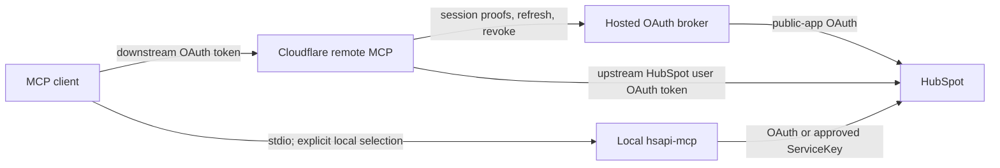

# Remote MCP Architecture

HSAPI now has a deployment-ready remote MCP package in
`cloudflare/hsapi-remote-mcp`. It is intentionally a smaller OAuth-only
connector, not a remotely hosted copy of every local CLI capability. A
transition production deployment exists, but the target architecture is not
complete until it uses the dedicated remote HubSpot app and remote-role broker
defined in [`docs/OAUTH_APP_SPLIT.md`](OAUTH_APP_SPLIT.md).

## Recommended two-connector model

Register two connectors with names that communicate their trust boundary:

| Connector | Default role | Credential boundary | Capability boundary |
|---|---|---|---|
| `hubspot-oauth-remote` | Use first for normal agent work | Cloudflare-hosted HubSpot user-level OAuth app (marketplace distribution); no local secret and no ServiceKey | Named endpoints plus scope-bound raw HubSpot paths, further reduced by the user's granted scopes |
| `hubspot-local-superset` | Use only when the remote capability report says the operation is unavailable | Local hosted/local OAuth plus an explicitly configured, account-matched ServiceKey/private-app token when needed | Full local catalog, portal profiles, stronger-token endpoints, and approved Agent CLI bridges |

This is a capability split, not an automatic fallback chain. A client or agent
must select the local connector explicitly. The remote Worker never receives,
requests, imports, or retries with a ServiceKey.

Use [`examples/mcp-dual-connector.sample.json`](../examples/mcp-dual-connector.sample.json)
as a repo-safe illustration. MCP clients use different configuration field
names, so adapt the `url` entry to the client's remote/custom-connector UI
without changing either connector's credential boundary.

## Request flow

The remote flow has two independent OAuth layers. The Worker is the OAuth
authorization server/resource server for the MCP client. For upstream HubSpot
OAuth it is a confidential broker client: it creates a PKCE- and
consume-secret-bound broker session, receives a one-time completion grant at
its exact allowlisted HTTPS callback, and uses the broker for exchange,
refresh, and compensating revoke. It binds the downstream grant to the
broker's introspection-validated HubSpot `hubId`, user, client ID, user-level
status, and granted scopes. It never forwards the MCP bearer to HubSpot or
returns the HubSpot bearer through an MCP tool.

HubSpot may retain scopes from an earlier authorization of the same public app
when a later session requests fewer scopes. The Worker stores that authoritative
actual scope set for refresh and revocation continuity, then attenuates the MCP
grant to the intersection with the remote deployment's configured scopes. A
retained scope cannot unlock a remote capability. Any actual scope outside the
explicit `HUBSPOT_APP_SCOPE_CEILING` is rejected and compensating-revoked.

The broker source is shared, but its deployments are not. A `local` broker
accepts only the native localhost completion used by CLI and local stdio
hosted-OAuth profiles. A separate `remote` broker accepts only the
operator-allowlisted canonical HTTPS callback used by the remote MCP Worker.
Each role has its own HubSpot app, client secret, signing key, state, hostname,
and deployment config. The remote Worker requires the broker session response
to identify `brokerRole: "remote"`; it does not use the CLI's token cache or
loopback listener.

That distinction also applies during development. The checked-in remote Worker
origin `http://localhost:8787` supports tests and dry-runs but cannot complete
interactive broker OAuth. Interactive `wrangler dev` testing requires an HTTPS
tunnel or dedicated HTTPS development origin, matching `PUBLIC_ORIGIN` and
`MCP_ALLOWED_ORIGINS`, and an exact
`<PUBLIC_ORIGIN>/hubspot/callback` entry in the broker's remote-completion
allowlist. The native CLI's ephemeral `127.0.0.1` callback remains a separate
loopback-only protocol and cannot be reused by the remote Worker.

The local connector keeps the existing portal-profile model. A combined local
profile may hold hosted OAuth cache metadata plus the environment-variable name
for an approved ServiceKey. The operator must verify both credentials belong
to the same account. Local HSAPI still does not silently retry OAuth with the
ServiceKey.

## How agents should route work

1. Start with `hsapi_remote_identity` and `hsapi_remote_capabilities`.
2. Call `hsapi_remote_endpoint_help` for the selected endpoint ID (and CRM
   object type) to get its exact executor input and current scope/gate status.
3. Use `hsapi_request_execute_read` for a capability reported as available.
4. If the capability is absent, stop and explain why. Use the local connector
   only when the operator's task and authorization actually require it.
5. Never move a remote request to the local ServiceKey connector merely to
   avoid a permission error. First distinguish missing app scope, missing user
   permission, product entitlement, user-level token rejection, and a
   deliberately absent remote capability.
6. Keep writes on the connector selected for the operation. Do not preview a
   write remotely and execute a different request locally.

Typical local-only work includes non-user-token endpoints, schema and other
administrative surfaces, custom-object work while its public-app scopes remain
unrecognized, Price Books, and saved-report/saved-view delegation to HubSpot
Agent CLI.

## Remote capability lifecycle

The remote policy is deliberately fail-closed but not limited to named wrappers.
Callers may use a packaged endpoint ID or supply a raw method, path, query, and
JSON body. Raw calls cannot supply an origin, authorization header, portal, auth
mode, or arbitrary external URL. A raw path must be a strict CRM-object or
Marketing Events path whose object family maps to an exposed OAuth scope, or a
catalog path whose explicit scope is in the remote manifest. Custom records use
only canonical numeric object type IDs in `2-<digits>` form. Catalog
method/path/risk drift still fails validation for named operations.

Policy eligibility is the intersection of four controls:

1. the named endpoint or raw path maps to a scope in the remote manifest;
2. the Worker feature gate permits the operation;
3. the downstream MCP grant has `hsapi.read` or `hsapi.write`; and
4. the attenuated HubSpot scope set for this deployment contains the exact
   required scope.

HubSpot can still reject an eligible request because of user permission,
product entitlement, beta enrollment, or user-level-token restrictions. The
capability report does not make a live probe; prove representative operations
in staging.

The checked-in deployment requires the broker's normalized,
introspection-validated response to report `isUserLevel=true` for the exact
configured HubSpot client ID. An ordinary app-scoped public-app grant is
rejected by design. Relaxing
`HUBSPOT_REQUIRE_USER_LEVEL` would change the trust model and requires a
separate architecture review; it is not a routine deployment substitution.

### Writes

Writes are enabled for the reviewed scope boundary with
`REMOTE_WRITES_ENABLED=true`. The write tool is registered only when the
downstream grant includes `hsapi.write`. Mutations and destructive operations
are both supported when the relevant HubSpot write scope is present. Every
write requires a blocked preview plus a short-lived
confirmation token bound to the exact method, path, query, body, HubSpot
account, user, downstream client, token lifetime, risk classification, required
scopes, and remote capability revision. A SQLite `CONFIRMATION_LEDGER` Durable
Object atomically claims the nonce before execution, so the token is single-use
even under concurrent requests.

The model may inspect that preview and make the matching confirmation call when
the action is within the user's request. The server does not impose a separate
human approval step.

The checked-in HubSpot request contains 19 read scopes and 12 write scopes. It
supports generic create/update/batch create/update/upsert for contacts,
companies, deals, tickets, line items, products, tasks, notes, calls, meetings,
and emails, plus archive, merge, GDPR delete, batch archive, and raw subpaths
within those object families. Marketing Events has the same raw fallback. It
does not infer quote
write authority from `cpq.quotes.write`, because the current CRM Quotes methods
require `crm.objects.quotes.write`; that user-level scope is not accepted by the
active app platform. Any added write must still have an exact manifest endpoint,
scope, confirmation behavior, fresh consent, and live validation. The raw
fallback does not manufacture a scope that the app did not receive.

### Contracts

The remote manifest supports Contracts list, get, search, and batch-read with
`crm.objects.contracts.read`; actual product/tier behavior remains a HubSpot
runtime decision. Contract writes remain a planned capability: add them only
after HubSpot publishes the public-beta endpoint contract and the method, path,
scope, tier, user-level-token behavior, confirmation semantics, and catalog
metadata have all been verified. Do not reserve or guess an endpoint ID.

### Price Books

Price Books are a `2026-09-beta` API, but their `cpq.price_books.read` and
`cpq.price_books.write` permissions are private-app access scopes rather than
public-app OAuth scopes. They are intentionally absent from the remote app,
broker request, scope ceiling, and endpoint manifest. Use the local connector
with a ServiceKey/private-app bearer that has the appropriate Price Books
access. The local catalog and typed read commands remain available.

### Custom objects

The Worker policy and tests stage schema list/get plus custom record read/write
operations through the named and raw executors, accepting only canonical object
type IDs in `2-<digits>` form. They remain unavailable in the active OAuth
configuration. A live upload of the 2026.03 user-level remote app on July 30,
2026 built successfully but failed deployment because HubSpot did not recognize
`crm.objects.custom.read`, even though HubSpot's scope guide names it as an
optional public-app scope. The four record/schema read/write candidates remain
in `data/hubspot-oauth-apps.json` for recheck, while both app manifests, brokers,
and the remote request exclude them. Custom record writes will become usable
only after HubSpot grants `crm.objects.custom.write`; custom schema writes remain
local.

## OAuth state boundary

Remote consent and upstream broker state are short-lived rows in the SQLite
`AuthorizationState` Durable Object bound as `AUTHORIZATION_STATE`. The consent
transition requires a one-time hidden CSRF proof and an exact `PUBLIC_ORIGIN`
form origin. Only the proof hash is stored, and a missing or incorrect origin or
proof cannot consume valid state. The consent document uses `Referrer-Policy:
strict-origin`; using `no-referrer` here would make a basic browser form POST send
`Origin: null`. Redirect responses retain `Referrer-Policy: no-referrer`. The
successful consent document's CSP permits the same-origin POST plus only the
fixed HubSpot authorization origin, configured broker origin, and the initiating
client's registered redirect origin, which Chromium requires when it checks
`form-action` across HTTP redirects. Error documents remain same-origin-only. The
broker completion callback requires a
separate per-session browser-binding proof. The Worker sends that same random
proof in a Secure, HttpOnly, SameSite=Lax primary cookie and a Secure, HttpOnly,
SameSite=None, Partitioned fallback cookie for embedded MCP authorization
windows. Its atomic state row is keyed by the broker session ID and retains the
raw consume secret plus Worker-held S256 PKCE verifier; the broker stores only
the consume-secret digest and PKCE challenge. A successful HubSpot callback
terminates at the broker, which redirects only a one-time completion grant to
the Worker. Each Worker row expires after ten minutes and is consumed only
after proof validation; concurrent or replayed takes cannot receive the same
payload.

Because storage timing and duplicate callbacks are part of the security
contract, staging must exercise expired state, replay after consumption, two
near-simultaneous callbacks, missing/wrong consent origin and proof, both the
primary and partitioned callback-cookie paths, a missing/wrong callback cookie,
and a wrong PKCE/code exchange. Invalid proof attempts must not consume a valid
flow, and no replay or concurrent attempt may create a second usable grant.

Staging must also issue parallel downstream refresh requests for one grant and
verify that identity and scopes do not cross grants and that a usable refreshed
grant remains. The current OAuth-provider dependency owns refresh-token
rotation. Add dependency serialization as a follow-up only if repeated staging
tests reproduce a race; it is not part of the current architecture merely as a
precaution.

The Worker calls the broker revoke endpoint as compensating cleanup when a
newly issued grant fails client/user/account/scope continuity checks or when
downstream authorization completion fails after exchange. The current
Cloudflare OAuth-provider dependency does not expose a safe upstream-revoke
hook when a client revokes its provider-owned downstream refresh token. The
Worker therefore does not decrypt or reimplement provider-private token
internals, and ordinary downstream revocation does not yet trigger upstream
broker revoke. For immediate upstream invalidation, remove the app grant in
HubSpot; revisit this boundary if the provider adds a supported revocation
callback.

## Operations and deployment

The Worker deployment runbook, bindings, security controls, and validation
matrix are in
[`cloudflare/hsapi-remote-mcp/README.md`](../cloudflare/hsapi-remote-mcp/README.md).
The required sequence is:

1. run generated-type, TypeScript, Worker-runtime, and Wrangler dry-run checks;
2. create one staging `OAUTH_KV` namespace and an independent state-encryption
   secret;
3. retain the declarative SQLite `AUTHORIZATION_STATE` / `AuthorizationState`
   and `CONFIRMATION_LEDGER` / `ConfirmationLedger` bindings and exports, then
   configure three distinct rate-limit namespaces, an exact staging origin,
    dedicated remote-role broker URL, matching remote-app client ID, reviewed
    reviewed read/write scope list and explicit public-app scope ceiling in the
    gitignored operator config; have that remote broker allowlist the Worker's
    exact HTTPS completion callback;
4. keep the write scope boundary and confirmation gate enabled, deploy staging only
   after operator approval, and complete the full OAuth,
   replay/concurrency, mutation-preview, and negative-capability test matrix;
5. recheck custom-object scope deployment, Contracts, and all user-level app
   scopes against current HubSpot behavior; and
6. create independent production state only after staging passes. The exact
   production operator config must use either a reachable canonical custom
   domain with its matching route and `workers_dev=false`, or the actual
   `workers.dev` origin, and must pass an explicit production dry run.

The hourly OAuth cleanup runs at minute 17 with a batch size of 200.

Code, config, and a successful dry run do not authorize a new production
cutover. The dedicated-app connector is live only after its deployed URL,
remote-role broker, OAuth flow, HubSpot identity, and representative runtime
calls are verified.

## Related documentation

- [`docs/MCP.md`](MCP.md): local and remote MCP tool selection
- [`docs/OAUTH_SETUP.md`](OAUTH_SETUP.md): CLI hosted broker and OAuth account binding
- [`docs/OAUTH_APP_SPLIT.md`](OAUTH_APP_SPLIT.md): separate app/broker setup and cutover order
- [`docs/DESKTOP_MCP_QUICKSTART.md`](DESKTOP_MCP_QUICKSTART.md): desktop connector setup
- [`docs/hubspot-api-context/contracts.md`](hubspot-api-context/contracts.md): Contracts API status
- [`docs/hubspot-api-context/price-books.md`](hubspot-api-context/price-books.md): Price Books beta guardrails
- [`SECURITY.md`](../SECURITY.md): repository-wide credential boundaries
